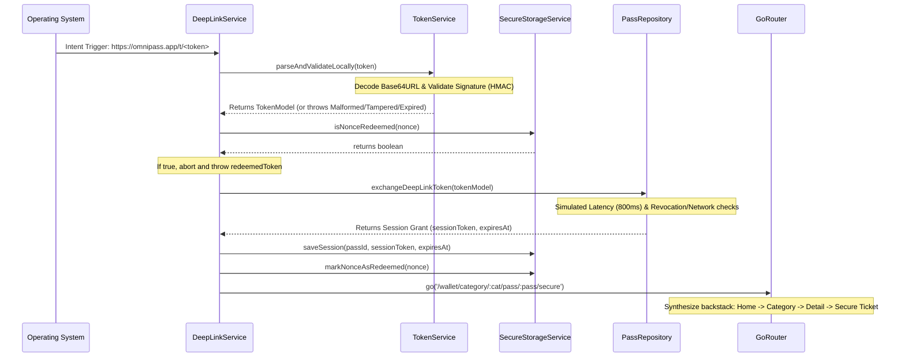

# OmniPass Digital Wallet

OmniPass is a digital wallet application for storing event tickets, access passes, and smart-access credentials. This project is built as part of the Khizex Mobile Engineering Internship Week 4 assignment.

The core architecture implements a **deep-link driven routing structure** that automatically constructs hierarchical backstack paths when loading direct pass states, protected by client-side cryptographic signature validation and simulated single-use secure storage checks.

---

## Technical Stack

- **Framework**: [Flutter](https://flutter.dev) (Dart with strong typing & null safety)
- **Routing**: [go_router](https://pub.dev/packages/go_router) (Declarative type-safe routing)
- **State Management**: [GetX](https://pub.dev/packages/get) (Decoupled controllers and dependency injection)
- **Secure Storage**: [flutter_secure_storage](https://pub.dev/packages/flutter_secure_storage) (For credentials cache)
- **Networking**: [Dio](https://pub.dev/packages/dio) (HTTP client foundation)
- **Deep Linking**: [app_links](https://pub.dev/packages/app_links) (Unified link streams handling cold/warm launches)
- **Cryptography**: [crypto](https://pub.dev/packages/crypto) (HMAC-SHA256 signature verification)

---

## Directory Architecture

The project implements a feature-based Clean Architecture structure:

```text
lib/
├── core/
│   ├── errors/          # Typed AppError classes & custom enums (revoked, tampered)
│   ├── network/         # HTTP Dio client wrapper
│   ├── storage/         # Secure storage session & nonce cache (flutter_secure_storage)
│   └── theme/           # Color palettes, gradients, and custom themes
├── data/
│   ├── models/          # Strongly-typed models (PassModel, CategoryModel, TokenModel)
│   └── repositories/    # Mock pass repository & simulated token exchange backend
├── features/            # UI Views & business controllers
│   ├── category/        # Pass listings for specific category IDs
│   ├── error/           # Error display view mapping specific AppErrorType enums
│   ├── pass_detail/     # Detailed ticket card with active token request integration
│   ├── profile/         # User profile and signed Deep Link Simulator Console
│   ├── secure_ticket/   # High-security ticket QR with scoped session validations
│   ├── splash/          # Bootstrapper, launch handler, & cold-start routing
│   └── wallet/          # Main dashboard (featured carousels, quick links)
├── routing/             # go_router declarative route maps
├── services/            # DeepLinkService & TokenService (HMAC parser & validator)
└── main.dart            # Application bootstrap and DI configurations
```

---

## Route Structure

We configure `go_router` in a nested/hierarchical route design. When navigating directly to a deep sub-route, `go_router` automatically builds the parent navigator stack. Tapping "Back" will step backward correctly through the stack:

```text
/ (Splash Screen)
 └── /wallet (Wallet Home Dashboard)
      └── /wallet/category/:categoryId (Category Screen)
           └── /wallet/category/:categoryId/pass/:passId (Pass Detail Screen)
                └── /wallet/category/:categoryId/pass/:passId/secure (Secure Ticket View)

/error (Deep Link Error Screen)
/profile (Profile & Settings Screen)
```

For example, navigating directly to `/wallet/category/events/pass/pass_concert_1/secure` builds the following stack:
1. `WalletHomeScreen` (Base)
2. `CategoryScreen(categoryId: 'events')`
3. `PassDetailScreen(passId: 'pass_concert_1')`
4. `SecureTicketScreen(passId: 'pass_concert_1')` (Active viewport)

Tapping **Back** from the Secure Ticket Screen returns to the Pass Detail Screen, then to the Category Screen, and finally to the Wallet Home Screen.

---

## Deep Link Security Architecture (Phase 2)

OmniPass deep links carry a Base64URL-encoded token representation of a security ticket request:
`https://omnipass.app/t/<base64url-token>`

### 1. Token Model Schema
The payload contains the following attributes:
*   `passId` (String): The targeted unique identifier of the secure pass.
*   `issuedAt` (int): Unix epoch timestamp of when the token was created.
*   `expiresAt` (int): Unix epoch timestamp of when the token expires.
*   `nonce` (String): A unique identifier (jti) to prevent replay attacks.
*   `scope` (String): Granular accessibility constraints (default: `pass`).
*   `signature` (String): HMAC-SHA256 signature generated over the sorted JSON payload.

### 2. Client-Side Cryptographic Verification
*   **Signature Checking**: The `TokenService` extracts the token payload, removes the signature key, sorts the remaining map keys deterministically, encodes the payload to JSON, and computes the expected HMAC-SHA256 signature using a pre-shared secret key (`omnipass_secure_key_2026`). If the computed signature does not match the provided signature, the request is rejected with `AppErrorType.invalidSignature`.
*   **Temporal Validation**: Before executing any network call, the token expiry is verified locally. If `DateTime.now()` is past `expiresAt`, or if `expiresAt <= issuedAt`, the token is rejected as `expiredToken` or `malformedLink`.

### 3. Local Single-Use Cache (Anti-Replay)
Each deep link nonce is written to the device's secure storage keychain upon successful verification. If a link is clicked again, the app immediately intercepts the nonce from secure storage (`isNonceRedeemed`) and rejects it as `redeemedToken` without executing a server call.

### 4. Simulated Backend Token Exchange
Once local validation passes, the token is sent to the `PassRepository` simulated endpoint:
*   **Network Latency Simulation**: Delayed by 800ms to mimic server response times and display a high-fidelity loader.
*   **Blacklist Check**: Nonces matching `nonce_revoked` throw a `revokedToken` exception.
*   **Access Scoping**: If the token passes exchange checks, the server returns a scoped session grant payload containing a distinct `sessionToken` and `expiresAt` ISO8601 timestamp.

### 5. Scoped Access Control
The session grant is stored in secure storage under a pass-specific key: `session_token_pass_<passId>`.
When the `SecureTicketScreen` launches, `SecureTicketController` queries the secure storage keychain for that *specific* pass. If missing, or if the stored session expiry timestamp has lapsed, it immediately redirects the user to the access error screen. Having a valid session for one pass does **not** grant access to others.

---

## Deep-Link Lifecycle Flow



---

## Production Setup Files

To support production-level deep linking, place the following configuration files on your web host:

### Android App Links (`.well-known/assetlinks.json`)
```json
[
  {
    "relation": ["delegate_permission/common.handle_all_urls"],
    "target": {
      "namespace": "android_app",
      "package_name": "com.khizex.omnipass",
      "sha256_cert_fingerprints": [
        "FA:2C:19:12:44:A2:3B:5A:F3:D4:F2:77:E1:92:2C:39:AA:F4:71:0D:33:6C:54:99:A2:3C:99:EE:E2:0F:77:FF"
      ]
    }
  }
]
```

### iOS Universal Links (`.well-known/apple-app-site-association`)
```json
{
  "applinks": {
    "apps": [],
    "details": [
      {
        "appID": "9H9382HG62.com.khizex.omnipass",
        "paths": [ "/t/*" ]
      }
    ]
  }
}
```

---

## Setup & Running Instructions

### 1. Installation
Verify your environment matches our configurations, then execute:
```bash
flutter pub get
```

### 2. Run the Application
Execute on a connected device/emulator:
```bash
flutter run
```

### 3. Run Analysis & Unit Tests
To verify code formatting, architecture dependencies, and unit tests:
```bash
flutter analyze
flutter test
```

---

## Testing Matrix & Deep-Link Simulation

### Method A: Profile Screen Testing Console (Recommended)
Navigate to the **Profile Screen** (profile icon in the top right of the Wallet Home Dashboard) and scroll to the **Deep Link Simulator Console** to execute the following test matrix:

| Test Case | Expected Behavior | UI / State Transition |
|---|---|---|
| **Concert Pass (Valid)** | Session Cached & Direct Routing | Splash Screen -> Secure Concert Ticket Screen (Valid backstack) |
| **VIP Lounge (Valid)** | Session Cached & Direct Routing | Splash Screen -> Secure VIP Lounge Screen (Valid backstack) |
| **Expired Pass Link** | Rejected Locally | Redirects to Error: "This secure access pass token has expired." |
| **Invalid Pass Link** | Rejected during exchange | Redirects to Error: "This secure access pass token is invalid." |
| **Redeemed Pass Link** | Nonce blocked locally (Single-use) | Redirects to Error: "This pass token has already been used/redeemed." |
| **Tampered Signature** | Cryptographic check failed | Redirects to Error: "The pass token signature is invalid or has been tampered with." |
| **Revoked Pass Link** | Revoked by simulated backend | Redirects to Error: "This secure access pass token has been revoked." |
| **Malformed URL Link** | JSON Decode exception | Redirects to Error: "The link format is malformed or invalid." |
| **Server Connection** | Network Failure simulated | Redirects to Error: "Failed to connect to the secure pass server." |

### Method B: Native ADB Intent CLI Triggers (Android Emulator)
Use the commands below to simulate cold start, background resume, and foreground link captures:

```bash
# 1. Test Valid Concert Pass Deep Link
adb shell am start -W -a android.intent.action.VIEW -d "https://omnipass.app/t/eyJleHBpcmVzQXQiOjE3OTM0NTA0MDAsImlzc3VlZEF0IjoxNzIyNDIwMDAwLCJub25jZSI6Im5vbmNlX2FkYl8xIiwicGFzc0lkIjoicGFzc19jb25jZXJ0XzEiLCJzY29wZSI6InBhc3MiLCJzaWduYXR1cmUiOiI1ODQ3NWJjY2ZlNDBhODMwZGUyYWJhMDlmMzJjZGE4MTNhM2UxZTJmNGNlZTBlMDJjZmE0MWVmYTk3Yzg4MTcyIn0=" assignment_4

# 2. Test Tampered Signature Deep Link (Fails Local Check)
adb shell am start -W -a android.intent.action.VIEW -d "https://omnipass.app/t/eyJleHBpcmVzQXQiOjE3OTM0NTA0MDAsImlzc3VlZEF0IjoxNzIyNDIwMDAwLCJub25jZSI6Im5vbmNlX2FkYl8xIiwicGFzc0lkIjoicGFzc19jb25jZXJ0XzEiLCJzY29wZSI6InBhc3MiLCJzaWduYXR1cmUiOiJpbnZhbGlkX3RhbXBlcmVkX3NpZ25hdHVyZSJ9" assignment_4

# 3. Test Expired Deep Link (Fails Local Temporal Check)
adb shell am start -W -a android.intent.action.VIEW -d "https://omnipass.app/t/eyJleHBpcmVzQXQiOjE3MjI0MjAwMDAsImlzc3VlZEF0IjoxNzIyNDEwMDAwLCJub25jZSI6Im5vbmNlX2FkYl8yIiwicGFzc0lkIjoicGFzc19jb25jZXJ0XzEiLCJzY29wZSI6InBhc3MiLCJzaWduYXR1cmUiOiJkOGNhMDJkZWI5YTI1NGE5NzExNWQ4OTc1ZDY4OWI2ZDcyZDc3NWIzMGVkZDliNDQyNzMwNDUwZDgxNmJhNGFiIn0=" assignment_4

# 4. Test Revoked Deep Link (Fails Exchange Check)
adb shell am start -W -a android.intent.action.VIEW -d "https://omnipass.app/t/eyJleHBpcmVzQXQiOjE3OTM0NTA0MDAsImlzc3VlZEF0IjoxNzIyNDIwMDAwLCJub25jZSI6Im5vbmNlX3Jldm9rZWQiLCJwYXNzSWQiOiJwYXNzX2NvbmNlcnRfMSIsInNjb3BlIjoicGFzcyIsInNpZ25hdHVyZSI6IjhiNjRlYjVjZDkxMTc0YmI1MDNhYWEzYjI2YTY5YWUzMjA1NTcwNjA5MDVhNzk0YjBmNmQ5MjY0NGVlMjUxYjEifQ==" assignment_4
```

---

## Security Scope & Tradeoffs

1.  **Symmetric Cryptography (HMAC)**: Using HMAC-SHA256 with a pre-shared key works well for proof-of-concept testing but carries risks in real production. If the mobile app is decompiled, the secret key could be extracted, enabling attackers to forge valid tokens. A production environment should use **Asymmetric Cryptography (RSA or ECDSA)**, where the server signs with a private key and the app verifies using an embedded public key.
2.  **State Synchronization**: Nonce redemption tracking relies on local secure storage. If a user uninstalls the app or deletes secure storage, the local cache of used nonces is cleared, potentially allowing reuse. Production systems should enforce nonce check logic strictly on the server during token exchange.
